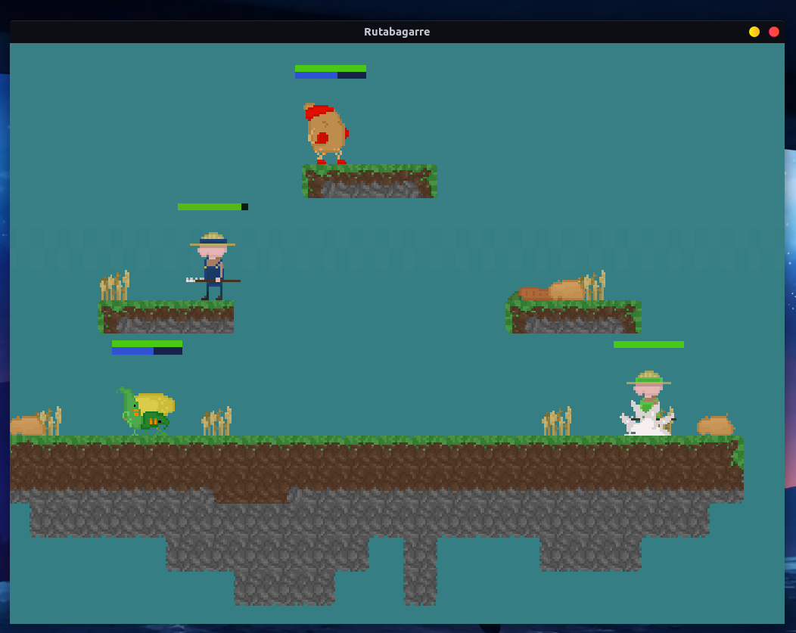
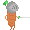
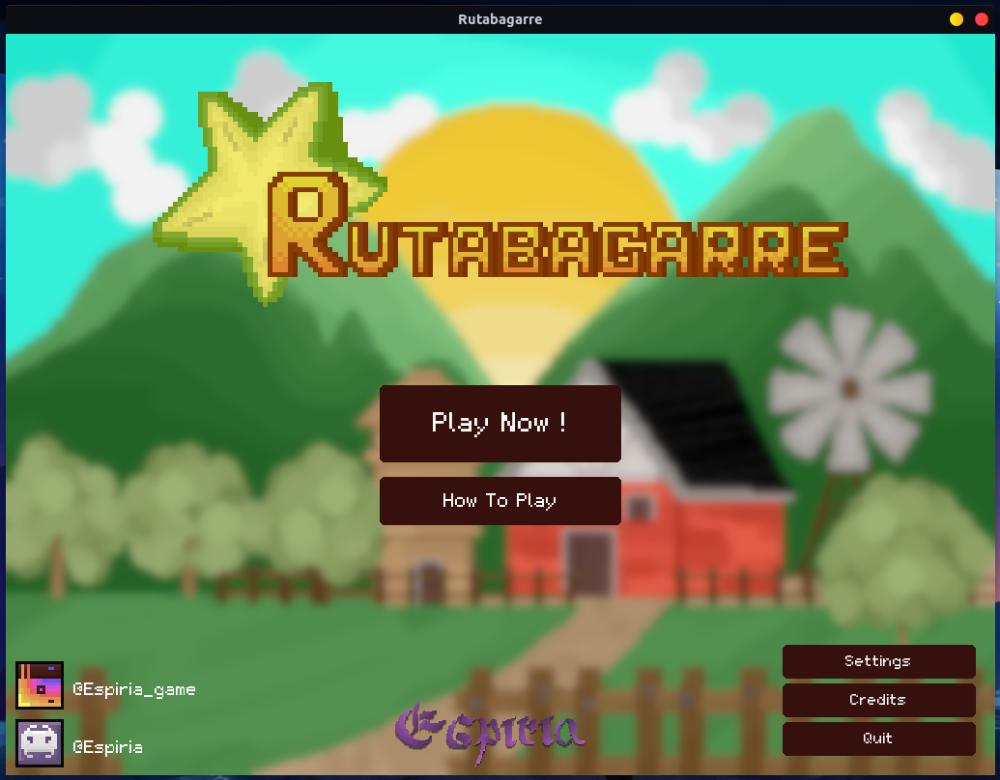
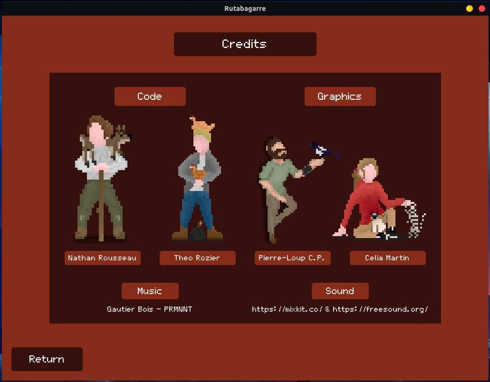

A Python game made for a GameJam with the themes "fruits and vegetables" and "to fall asleep and wake up". We got the obligation to use Pygame and a 1024 x 768 window, so don't juge us please.

## What is it?
An awesome ~~realistic, SSBU-killer~~ local-multiplayer fighting game where the player embodies a farmer that can take control of plants to fight other players.

## Playable incarnations
- A potato that punch hard and rolls on the enemies
- A corn that fires his kernels on the enemies 
- A swordsman carrot 

## HOW TO USE IT ?
1. Go to the [releases page](https://github.com/mindstorm38/rutabagarre/releases)
2. Chose a release (prefer the latest)
3. Follow the guide of the release you chose

## LANGUAGE:
User interface, code and comments are in english.
If we have time, a French version of the UI will be available.

## CREDITS
