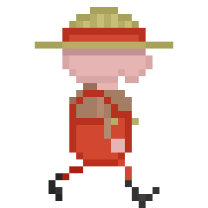

# Rutabagarre
A Python game made for a GameJam with the themes "fruits and vegetables" and "to fall asleep and wake up". We got the obligation to use Pygame, so don't juge us please.

# What is it?
An ~~awesome, realistic, SSBU-killer~~ local-multiplayer fighting game where the player embodies a farmer that can take control of plants to fight.

# Playable incarnations
- A potato that punch hard and rolls on the enemies
- A corn that fires his kernels on the enemies

## HOW TO USE IT ?
1. Wait until we make a release

## LANGUAGE:
User interface, code and comments are in english.
If we have time, a French version of the UI will be available.

## DISCLAIMERS
- WIP so it doesn't work fully. 
